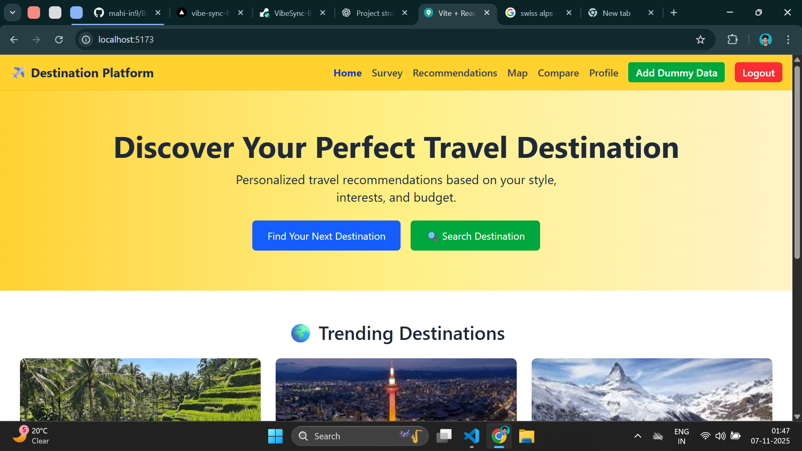
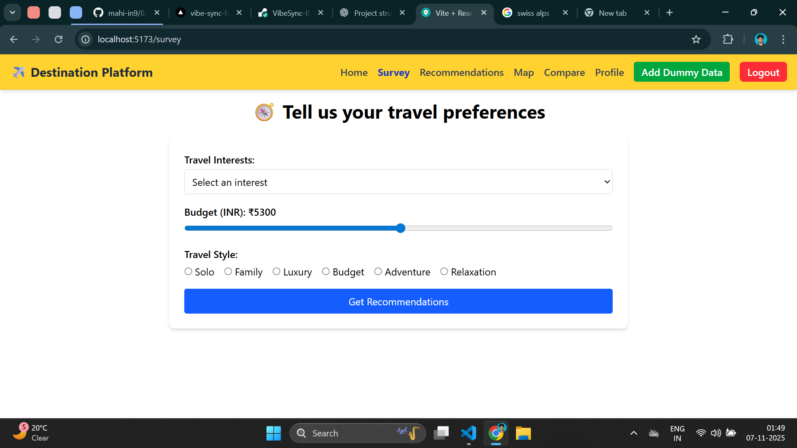
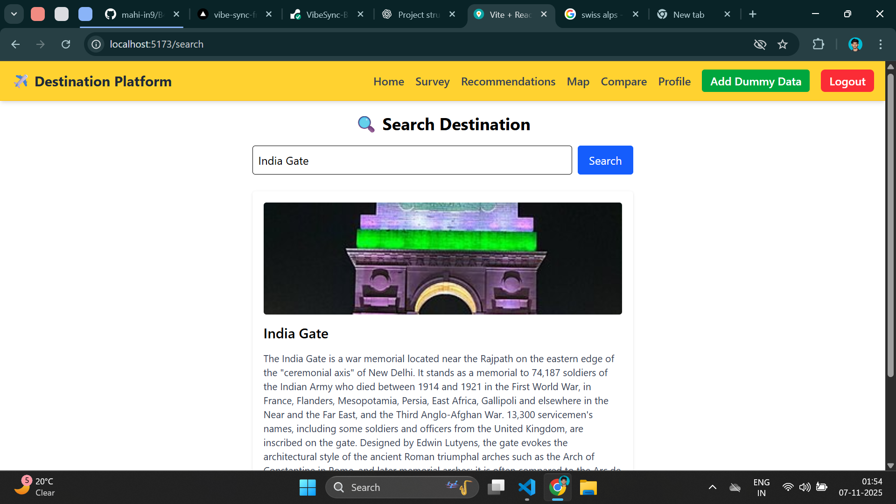
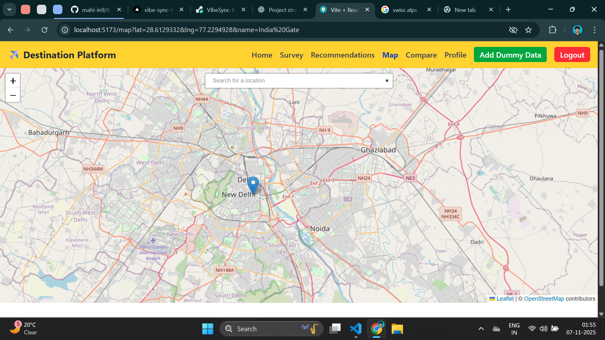

# B46-RCT-12_DestinationRecommendationPlatform_Travel

# ✈️ Destination Recommendation Platform

## 🌟 Introduction

The Destination Recommendation Platform helps users discover travel destinations tailored to their interests, travel styles, and budgets. Users can search destinations, view them on a map, complete a travel survey to get recommendations, save favorites, compare destinations, and explore them interactively.

---

## 🧭 Project Type

**Fullstack**  
Frontend: React.js (Vite), Redux Toolkit, TailwindCSS  
Backend: Firebase (Authentication + Firestore Database)  
Map: Leaflet.js + OpenStreetMap

---

## 🌐 Deployed App

- **Frontend**: [https://destinationrecommendationplatform.netlify.app/](https://destinationrecommendationplatform.netlify.app/)
- **Firebase Console**: [https://console.firebase.google.com/u/0/project/destinationrecommendation/overview](https://console.firebase.google.com/u/0/project/destinationrecommendation/overview)

---

## 📁 Directory Structure

destination-platform/
├── public/
├── src/
│ ├── apps/
│ ├── components/
│ ├── pages/
│ ├── services/
│ ├── utills/
│ ├── App.jsx
│ └── main.jsx
├── package.json
└── README.md

## 🔥 Features

- 🔍 Real-time destination search
- 🗺️ Map view with coordinates
- ✅ Personalized recommendations from user survey
- ⭐ Save to favorites (stored in Firebase)
- 🧭 Explore destinations
- 🔗 Share via Web Share API
- 🧮 Compare saved destinations
- 🧠 Geo-search and Wikipedia fallback integration

---

## 📐 Design Decisions & Assumptions

- Leaflet + OpenStreetMap used to avoid Google Maps API billing
- Wikipedia API used as a backup if Firebase has no entry
- All destination data (including favorites, explored, shared) is stored per user
- Firebase Firestore used for real-time data sync
- Redux Toolkit adopted for cleaner state management

---

## 🚀 Getting Started

### 🛠 Installation

```bash
git clone https://github.com/mahi-in9/B46-RCT-12_DestinationRecommendationPlatform_Travel.git
cd DestinationRecommendationPlatform_Travel
npm install
npm run dev

```

## 📸 Screenshots

### 🛬 Home Page


### 📃 Survey



### 🔍 Search



### 🗺️ Map View



